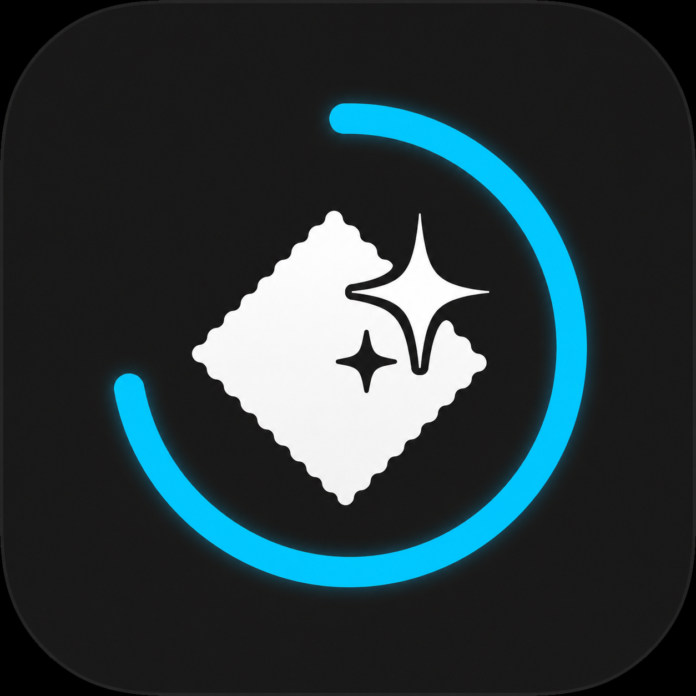

# MacWipePlus

[English](README.md)

<p align="center">
  
</p>

[](https://github.com/Mapleeeeeeeeeee/MacWipePlus/actions/workflows/ci.yml)

免費、本機運作的 macOS 清潔模式，支援 macOS 13 以上。

## Quick Start／快速開始

1. 下載最新版 [`MacWipePlus.dmg`](https://github.com/Mapleeeeeeeeeee/MacWipePlus/releases/latest)。
2. 開啟 DMG，將 `MacWipePlus.app` 拖到 Applications／應用程式。
3. 目前開發版本尚未使用 Apple Developer 憑證簽署或 notarize：對 App 按右鍵，選擇「打開」，再於確認視窗選擇一次「打開」。
4. 到「系統設定 → 隱私權與安全性 → 輔助使用」授權 MacWipePlus。
5. 從 Applications 啟動 App，再點選選單列圖示開始清潔模式。

## 功能

- 清潔模式期間攔截鍵盤、觸控板、滑鼠點擊與 Fn 列系統事件。
- 黑色全螢幕遮罩、倒數計時與儲存的時間偏好。
- 長按 `Esc` 3 秒退出。
- 緊急退出：`Control-Option-Esc`。
- 自訂時間範圍：10–3,600 秒。
- App 語言預設為英文，可從「語言」選單切換成繁體中文。
- 不會記錄、儲存或傳送鍵盤、指標或螢幕資料。

## 控制方式

- 選單列：選擇 15 秒、30 秒、1／2／5／10 分鐘、自訂秒數或不自動退出。
- 語言：選擇 English 或繁體中文，選擇會保存。
- 預設全域快捷鍵：`Control-Option-Command-M`。
- 可從選單列選擇「設定快捷鍵⋯」。
- 一般退出：長按 `Esc` 3 秒；遮罩會顯示剩餘時間。
- 緊急退出：`Control-Option-Esc`，也支援 `Control-Option-Command-Esc`。

## 從原始碼建置

```sh
swift build
./scripts/build-app.sh
```

App bundle 會輸出到 `.build/MacWipePlus.app`。

建立本機 DMG：

```sh
./scripts/package-dmg.sh
```

## 開發分支

- `main` 是穩定分支。
- `dev` 會透過 GitHub Actions 產生開發版 DMG 與 ZIP artifact。
- 推送符合 `v*` 的 tag 會建立 GitHub Release，附上 DMG 與 ZIP。

## 授權

Apache License 2.0，詳見 [LICENSE](LICENSE)。
